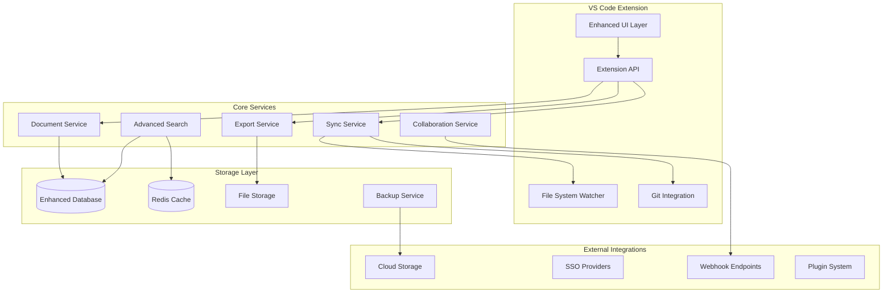

# Hive Docs Phase 2 Design Document

## Overview

Phase 2 transforms Hive Docs from a functional MVP into a comprehensive, enterprise-ready documentation platform. The design emphasizes scalability, collaboration, and deep integration with development workflows while maintaining the simplicity and VS Code integration that defines the core experience.

## Architecture

### High-Level Architecture



## Components and Interfaces

### Enhanced Document Model

```typescript
interface EnhancedDocument extends Document {
  // File tracking
  originalPath?: string;
  importedFrom?: string;
  lastSyncedAt?: Date;
  originalModifiedAt?: Date;
  syncStatus: 'synced' | 'modified' | 'conflict' | 'deleted';
  
  // Version control
  gitHash?: string;
  gitBranch?: string;
  contributors: string[];
  
  // Analytics
  viewCount: number;
  lastViewedAt?: Date;
  searchRank: number;
  
  // Collaboration
  comments: Comment[];
  shareLinks: ShareLink[];
  permissions: DocumentPermissions;
  
  // Content enhancements
  diagrams: DiagramReference[];
  attachments: Attachment[];
  linkedDocuments: string[];
}

interface FileWatchEntry {
  documentId: string;
  filePath: string;
  lastKnownHash: string;
  watcherActive: boolean;
}

interface SyncConflict {
  documentId: string;
  conflictType: 'content' | 'metadata' | 'deleted';
  localVersion: string;
  remoteVersion: string;
  baseVersion?: string;
  resolvedAt?: Date;
}
```

### Advanced Export System

```typescript
interface ExportRequest {
  documentIds: string[];
  format: ExportFormat;
  destination: ExportDestination;
  options: ExportOptions;
}

type ExportFormat = 
  | 'markdown'
  | 'html'
  | 'pdf'
  | 'mediawiki'
  | 'confluence'
  | 'zip'
  | 'git-repo';

interface ExportDestination {
  type: 'original' | 'directory' | 'cloud' | 'git';
  path?: string;
  preserveStructure: boolean;
  conflictResolution: 'overwrite' | 'backup' | 'prompt';
}

interface ExportProgress {
  requestId: string;
  status: 'queued' | 'processing' | 'completed' | 'failed';
  progress: number;
  processedCount: number;
  totalCount: number;
  errors: ExportError[];
}
```

### Collaboration Framework

```typescript
interface CollaborationService {
  // Real-time collaboration
  startCollaborationSession(documentId: string): Promise<SessionId>;
  joinSession(sessionId: SessionId): Promise<void>;
  broadcastChange(sessionId: SessionId, change: DocumentChange): void;
  
  // Comments and annotations
  addComment(documentId: string, comment: Comment): Promise<void>;
  resolveComment(commentId: string): Promise<void>;
  getComments(documentId: string): Promise<Comment[]>;
  
  // Sharing and permissions
  createShareLink(documentId: string, permissions: SharePermissions): Promise<ShareLink>;
  updatePermissions(documentId: string, permissions: DocumentPermissions): Promise<void>;
  
  // Approval workflows
  submitForReview(documentId: string, reviewers: string[]): Promise<void>;
  approveDocument(documentId: string, approval: Approval): Promise<void>;
}

interface Comment {
  id: string;
  documentId: string;
  author: string;
  content: string;
  position: TextPosition;
  createdAt: Date;
  resolved: boolean;
  replies: Comment[];
}
```

### Advanced Search Engine

```typescript
interface AdvancedSearchService {
  // Enhanced query processing
  parseQuery(query: string): SearchQuery;
  executeSearch(query: SearchQuery): Promise<SearchResults>;
  
  // Faceted search
  getFacets(query: SearchQuery): Promise<SearchFacets>;
  searchWithFacets(query: SearchQuery, facets: SelectedFacets): Promise<SearchResults>;
  
  // Search analytics
  recordSearch(query: string, results: SearchResults): void;
  getPopularQueries(): Promise<QueryAnalytics[]>;
  getSuggestedQueries(partial: string): Promise<string[]>;
  
  // Content analysis
  findSimilarDocuments(documentId: string): Promise<Document[]>;
  detectDuplicates(): Promise<DuplicateGroup[]>;
  analyzeContentGaps(): Promise<ContentGapAnalysis>;
}

interface SearchQuery {
  text: string;
  filters: SearchFilter[];
  sortBy: SortOption;
  dateRange?: DateRange;
  tags?: string[];
  authors?: string[];
}
```

### Plugin System Architecture

```typescript
interface PluginAPI {
  // Content processing
  registerContentProcessor(processor: ContentProcessor): void;
  registerImportHandler(handler: ImportHandler): void;
  registerExportHandler(handler: ExportHandler): void;
  
  // UI extensions
  registerCommand(command: Command): void;
  registerViewProvider(provider: ViewProvider): void;
  addMenuItem(item: MenuItem): void;
  
  // Storage extensions
  registerStorageProvider(provider: StorageProvider): void;
  registerBackupProvider(provider: BackupProvider): void;
  
  // Integration hooks
  onDocumentChange(callback: DocumentChangeCallback): void;
  onSearch(callback: SearchCallback): void;
  onExport(callback: ExportCallback): void;
}

interface Plugin {
  id: string;
  name: string;
  version: string;
  activate(api: PluginAPI): Promise<void>;
  deactivate(): Promise<void>;
}
```

## Data Models

### Enhanced Database Schema

```sql
-- File tracking and sync
CREATE TABLE file_tracking (
  id TEXT PRIMARY KEY,
  document_id TEXT REFERENCES documents(id),
  original_path TEXT NOT NULL,
  imported_from TEXT,
  last_synced_at TIMESTAMP,
  original_modified_at TIMESTAMP,
  sync_status TEXT CHECK (sync_status IN ('synced', 'modified', 'conflict', 'deleted')),
  git_hash TEXT,
  git_branch TEXT,
  watcher_active BOOLEAN DEFAULT FALSE,
  created_at TIMESTAMP DEFAULT CURRENT_TIMESTAMP
);

-- Collaboration features
CREATE TABLE comments (
  id TEXT PRIMARY KEY,
  document_id TEXT REFERENCES documents(id),
  author TEXT NOT NULL,
  content TEXT NOT NULL,
  position_start INTEGER,
  position_end INTEGER,
  created_at TIMESTAMP DEFAULT CURRENT_TIMESTAMP,
  resolved BOOLEAN DEFAULT FALSE,
  parent_comment_id TEXT REFERENCES comments(id)
);

CREATE TABLE share_links (
  id TEXT PRIMARY KEY,
  document_id TEXT REFERENCES documents(id),
  token TEXT UNIQUE NOT NULL,
  permissions TEXT NOT NULL, -- JSON
  expires_at TIMESTAMP,
  created_by TEXT NOT NULL,
  created_at TIMESTAMP DEFAULT CURRENT_TIMESTAMP,
  access_count INTEGER DEFAULT 0
);

-- Analytics and insights
CREATE TABLE document_analytics (
  id TEXT PRIMARY KEY,
  document_id TEXT REFERENCES documents(id),
  view_count INTEGER DEFAULT 0,
  last_viewed_at TIMESTAMP,
  search_rank REAL DEFAULT 0,
  quality_score REAL DEFAULT 0,
  staleness_score REAL DEFAULT 0,
  updated_at TIMESTAMP DEFAULT CURRENT_TIMESTAMP
);

CREATE TABLE search_analytics (
  id TEXT PRIMARY KEY,
  query TEXT NOT NULL,
  result_count INTEGER,
  clicked_document_id TEXT,
  user_id TEXT,
  created_at TIMESTAMP DEFAULT CURRENT_TIMESTAMP
);

-- Export tracking
CREATE TABLE export_jobs (
  id TEXT PRIMARY KEY,
  format TEXT NOT NULL,
  destination TEXT NOT NULL,
  document_ids TEXT NOT NULL, -- JSON array
  status TEXT CHECK (status IN ('queued', 'processing', 'completed', 'failed')),
  progress REAL DEFAULT 0,
  error_message TEXT,
  created_at TIMESTAMP DEFAULT CURRENT_TIMESTAMP,
  completed_at TIMESTAMP
);
```

### Caching Strategy

```typescript
interface CacheService {
  // Search result caching
  cacheSearchResults(query: string, results: SearchResults, ttl: number): Promise<void>;
  getCachedSearchResults(query: string): Promise<SearchResults | null>;
  
  // Document rendering cache
  cacheRenderedDocument(documentId: string, format: string, content: string): Promise<void>;
  getCachedRenderedDocument(documentId: string, format: string): Promise<string | null>;
  
  // Analytics cache
  cacheAnalytics(key: string, data: any, ttl: number): Promise<void>;
  getCachedAnalytics(key: string): Promise<any | null>;
  
  // Cache invalidation
  invalidateDocument(documentId: string): Promise<void>;
  invalidateSearch(pattern?: string): Promise<void>;
  clearCache(): Promise<void>;
}
```

## Error Handling

### Advanced Error Recovery

```typescript
interface ErrorRecoveryService {
  // Sync conflict resolution
  detectSyncConflicts(): Promise<SyncConflict[]>;
  resolveSyncConflict(conflictId: string, resolution: ConflictResolution): Promise<void>;
  
  // Data corruption recovery
  validateDataIntegrity(): Promise<IntegrityReport>;
  repairCorruption(issues: IntegrityIssue[]): Promise<RepairResult>;
  
  // Export error handling
  retryFailedExport(exportId: string): Promise<void>;
  recoverPartialExport(exportId: string): Promise<void>;
  
  // Collaboration error recovery
  resyncCollaborationSession(sessionId: string): Promise<void>;
  resolveEditConflicts(documentId: string): Promise<void>;
}

interface ConflictResolution {
  strategy: 'accept-local' | 'accept-remote' | 'manual-merge';
  mergedContent?: string;
  preserveHistory: boolean;
}
```

## Testing Strategy

### Comprehensive Test Coverage

```typescript
// Integration tests for file sync
describe('File Synchronization', () => {
  test('should detect external file changes');
  test('should handle sync conflicts gracefully');
  test('should preserve document history during sync');
  test('should handle file deletions appropriately');
});

// Performance tests for large datasets
describe('Performance with Large Collections', () => {
  test('should handle 10,000+ documents efficiently');
  test('should maintain search performance under load');
  test('should stream large exports without memory issues');
});

// Collaboration tests
describe('Real-time Collaboration', () => {
  test('should handle simultaneous edits');
  test('should sync comments across sessions');
  test('should maintain consistency during network issues');
});

// Plugin system tests
describe('Plugin System', () => {
  test('should load and activate plugins safely');
  test('should handle plugin errors gracefully');
  test('should provide secure API access');
});
```

## Security Considerations

### Enterprise Security Framework

```typescript
interface SecurityService {
  // Authentication and authorization
  authenticateUser(credentials: Credentials): Promise<AuthResult>;
  authorizeAction(user: User, action: Action, resource: Resource): Promise<boolean>;
  
  // Data encryption
  encryptDocument(document: Document): Promise<EncryptedDocument>;
  decryptDocument(encrypted: EncryptedDocument): Promise<Document>;
  
  // Audit logging
  logAccess(user: User, resource: Resource, action: Action): Promise<void>;
  logDataChange(user: User, change: DataChange): Promise<void>;
  
  // Secure sharing
  createSecureShareLink(documentId: string, permissions: SharePermissions): Promise<SecureLink>;
  validateShareAccess(token: string): Promise<ShareValidation>;
}

interface AuditLog {
  id: string;
  userId: string;
  action: string;
  resourceType: string;
  resourceId: string;
  timestamp: Date;
  ipAddress: string;
  userAgent: string;
  success: boolean;
  details?: Record<string, any>;
}
```

## Performance Optimization

### Scalability Enhancements

```typescript
interface PerformanceService {
  // Database optimization
  optimizeSearchIndex(): Promise<void>;
  analyzeQueryPerformance(): Promise<QueryAnalysis[]>;
  suggestIndexImprovements(): Promise<IndexSuggestion[]>;
  
  // Memory management
  implementVirtualScrolling(container: HTMLElement, items: any[]): VirtualScrollManager;
  optimizeImageLoading(): Promise<void>;
  manageMemoryUsage(): Promise<MemoryReport>;
  
  // Background processing
  scheduleBackgroundTask(task: BackgroundTask): Promise<TaskId>;
  monitorTaskProgress(taskId: TaskId): Promise<TaskProgress>;
  
  // Caching optimization
  preloadFrequentlyAccessed(): Promise<void>;
  optimizeCacheStrategy(): Promise<CacheOptimization>;
}
```

This Phase 2 design provides a comprehensive roadmap for transforming Hive Docs into an enterprise-grade documentation platform while maintaining its core simplicity and VS Code integration. The modular architecture ensures that features can be implemented incrementally and that the system remains maintainable as it grows in complexity.