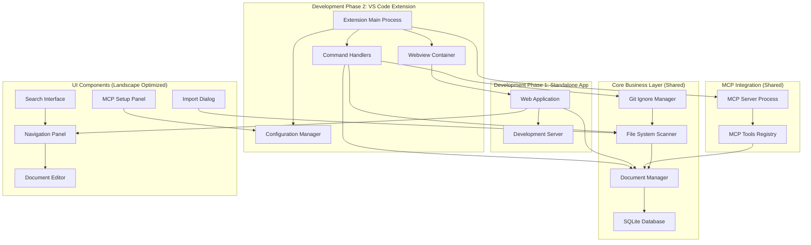

# Design Document

## Overview

Hive Docs is a VS Code extension that provides centralized documentation management through a wiki-style interface backed by SQLite storage and MCP server integration. The system consists of three main components: a VS Code extension frontend, a SQLite database layer, and an MCP server for AI agent integration.

The architecture follows a development-first approach where the core functionality is built as a standalone Node.js web application before being wrapped into a VS Code extension. This allows for easier development, testing, and debugging of the core features before dealing with VS Code extension complexities.

The UI is designed with a landscape layout optimized for VS Code's bottom panel, providing more horizontal space for document editing and navigation. The extension leverages VS Code's webview system to embed the standalone web interface, ensuring a native feel while maintaining development flexibility.

## Architecture

### Development Architecture Strategy

The system is designed to be developed in two phases:

**Phase 1: Standalone Node.js Application**
- Core business logic and database layer
- Web-based UI optimized for landscape layout
- MCP server integration
- Local development server for testing

**Phase 2: VS Code Extension Integration**
- Extension wrapper around the standalone app
- Webview integration for UI embedding
- VS Code API integration for commands and panels

### High-Level Architecture



### Component Responsibilities

**Standalone Web Application**: Core application logic that can run independently for development and testing. Provides the main wiki interface with landscape-optimized layout.

**Extension Main Process**: Lightweight wrapper that coordinates VS Code integration, manages extension lifecycle, and handles VS Code API integration.

**Webview Container**: Embeds the standalone web application within VS Code using the webview API, providing seamless integration while maintaining development flexibility.

**Core Business Layer**: Shared components that handle document management, database operations, file system scanning, and git integration. These components work identically in both standalone and extension modes.

**UI Components**: Web-based interface optimized for landscape/bottom panel layout, providing horizontal space for document editing and navigation.

**MCP Server**: Standalone process that exposes documentation tools to AI agents via the Model Context Protocol, independent of the UI layer.

## UI Design Strategy

### Landscape Layout Optimization

The interface is designed specifically for VS Code's bottom panel, taking advantage of the wider horizontal space:

- **Horizontal Navigation**: Document list/tree on the left, editor on the right
- **Split View**: Side-by-side markdown editing and preview
- **Compact Vertical Space**: Minimize vertical UI elements, maximize content area
- **Responsive Design**: Graceful degradation for different panel sizes

### Development-First Approach

The UI is built as a standard web application that can be:

1. **Developed Standalone**: Run in a browser with a local development server
2. **Tested Independently**: Full functionality testing without VS Code complexity
3. **Embedded Seamlessly**: Integrated into VS Code webviews without modification
4. **Debugged Easily**: Standard web development tools and workflows

### Webview Integration Strategy

VS Code's webview system provides:

- **Security**: Sandboxed execution with controlled message passing
- **Theming**: Automatic integration with VS Code themes and color schemes
- **Performance**: Efficient rendering with minimal extension host overhead
- **Flexibility**: Full web technology stack while maintaining native feel

## Components and Interfaces

### Extension Entry Point

```typescript
interface ExtensionContext {
  activate(context: vscode.ExtensionContext): Promise<void>
  deactivate(): Promise<void>
}

interface HiveDocsExtension {
  documentManager: DocumentManager
  mcpServer: MCPServerManager
  uiManager: UIManager
  configManager: ConfigurationManager
}
```

### Document Management

```typescript
interface DocumentManager {
  createDocument(title: string, content: string): Promise<Document>
  updateDocument(id: string, content: string): Promise<Document>
  deleteDocument(id: string): Promise<void>
  searchDocuments(query: string): Promise<Document[]>
  getAllDocuments(): Promise<Document[]>
}

interface Document {
  id: string
  title: string
  content: string
  createdAt: Date
  updatedAt: Date
  tags?: string[]
  metadata?: Record<string, any>
}
```

### File Import System

```typescript
interface FileImporter {
  scanWorkspace(): Promise<MarkdownFile[]>
  importFiles(files: MarkdownFile[], options: ImportOptions): Promise<ImportResult>
  applyIgnoreRules(files: MarkdownFile[]): MarkdownFile[]
}

interface ImportOptions {
  removeOriginals: boolean
  preserveStructure: boolean
  tagWithPath: boolean
}

interface MarkdownFile {
  path: string
  name: string
  content: string
  size: number
  ignored: boolean
}
```

### MCP Server Integration

```typescript
interface MCPServerManager {
  start(): Promise<void>
  stop(): Promise<void>
  isRunning(): boolean
  getServerInfo(): MCPServerInfo
}

interface MCPTools {
  readDocument(id: string): Promise<Document>
  writeDocument(title: string, content: string): Promise<Document>
  searchDocuments(query: string): Promise<Document[]>
  listDocuments(): Promise<Document[]>
}
```

### Configuration Management

```typescript
interface ConfigurationManager {
  getIgnoreRules(): string[]
  setIgnoreRules(rules: string[]): Promise<void>
  getGitIgnoreEnabled(): boolean
  setGitIgnoreEnabled(enabled: boolean): Promise<void>
  getMCPServerConfig(): MCPServerConfig
}
```

## Data Models

### Database Schema

```sql
-- Documents table
CREATE TABLE documents (
    id TEXT PRIMARY KEY,
    title TEXT NOT NULL,
    content TEXT NOT NULL,
    created_at DATETIME DEFAULT CURRENT_TIMESTAMP,
    updated_at DATETIME DEFAULT CURRENT_TIMESTAMP,
    tags TEXT, -- JSON array of tags
    metadata TEXT -- JSON object for additional metadata
);

-- Full-text search index
CREATE VIRTUAL TABLE documents_fts USING fts5(
    title, content, tags,
    content='documents',
    content_rowid='rowid'
);

-- Indexes for performance
CREATE INDEX idx_documents_title ON documents(title);
CREATE INDEX idx_documents_updated ON documents(updated_at);

-- Triggers to maintain FTS index
CREATE TRIGGER documents_ai AFTER INSERT ON documents BEGIN
    INSERT INTO documents_fts(rowid, title, content, tags) 
    VALUES (new.rowid, new.title, new.content, new.tags);
END;

CREATE TRIGGER documents_ad AFTER DELETE ON documents BEGIN
    INSERT INTO documents_fts(documents_fts, rowid, title, content, tags) 
    VALUES('delete', old.rowid, old.title, old.content, old.tags);
END;

CREATE TRIGGER documents_au AFTER UPDATE ON documents BEGIN
    INSERT INTO documents_fts(documents_fts, rowid, title, content, tags) 
    VALUES('delete', old.rowid, old.title, old.content, old.tags);
    INSERT INTO documents_fts(rowid, title, content, tags) 
    VALUES (new.rowid, new.title, new.content, new.tags);
END;
```

### Configuration Schema

```typescript
interface HiveDocsConfig {
  database: {
    path: string
    autoBackup: boolean
  }
  import: {
    ignoreRules: string[]
    defaultIgnoreRules: string[]
  }
  git: {
    ignoreDatabase: boolean
  }
  mcp: {
    enabled: boolean
    port: number
    autoStart: boolean
  }
  ui: {
    sidebarVisible: boolean
    previewMode: 'side' | 'tab'
  }
}
```

## Error Handling

### Database Error Handling

- **Connection Failures**: Retry with exponential backoff, fallback to read-only mode
- **Corruption Detection**: Automatic backup restoration, user notification with recovery options
- **Concurrent Access**: SQLite WAL mode for better concurrency, proper transaction handling
- **Migration Failures**: Rollback mechanism, data integrity verification

### MCP Server Error Handling

- **Server Start Failures**: Port conflict detection, automatic port selection
- **Tool Execution Errors**: Structured error responses, logging for debugging
- **Database Unavailable**: Graceful degradation, appropriate error messages to agents
- **Authentication Issues**: Clear error messages, setup guidance

### File System Error Handling

- **Permission Errors**: User notification with suggested solutions
- **File Not Found**: Graceful handling during import, cleanup of stale references
- **Git Integration Failures**: Fallback to manual instructions, non-blocking operation

## Testing Strategy

### Unit Testing

- **Database Operations**: Test CRUD operations, search functionality, concurrent access
- **File Import Logic**: Test ignore rules, content parsing, error scenarios
- **MCP Tools**: Test all exposed tools, error handling, data validation
- **Configuration Management**: Test setting persistence, validation, migration

### Integration Testing

- **VS Code Extension**: Test extension activation, command registration, UI integration
- **Database Integration**: Test schema creation, migrations, backup/restore
- **MCP Server Integration**: Test server lifecycle, tool registration, agent communication
- **File System Integration**: Test workspace scanning, git ignore management

### End-to-End Testing

- **Complete Workflows**: Test document creation → editing → MCP access → search
- **Import Workflows**: Test workspace scan → file selection → import → cleanup
- **Configuration Workflows**: Test settings changes → system updates → verification
- **Error Recovery**: Test database corruption → recovery → data integrity

### Performance Testing

- **Large Document Sets**: Test with 1000+ documents, search performance
- **Concurrent Access**: Test multiple agents accessing MCP simultaneously
- **File Import Performance**: Test importing large numbers of markdown files
- **Memory Usage**: Monitor extension memory footprint during heavy usage

## Security Considerations

### Data Protection

- **Local Storage Only**: All data remains on user's machine, no external transmission
- **Database Encryption**: Consider SQLite encryption for sensitive documentation
- **Access Control**: MCP server only accessible locally by default

### Input Validation

- **Document Content**: Sanitize markdown input, prevent XSS in webviews
- **File Paths**: Validate import paths, prevent directory traversal
- **MCP Requests**: Validate all agent requests, rate limiting if needed

### Extension Security

- **Webview Security**: Use VS Code's webview security features, CSP headers
- **Command Validation**: Validate all command parameters, prevent injection
- **Configuration Security**: Validate configuration values, secure defaults